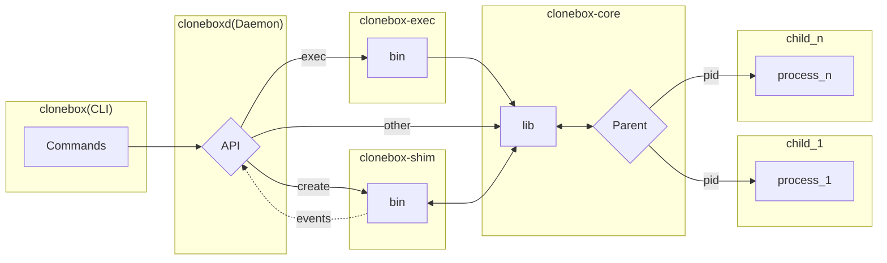

# Clonebox

Clonebox is a Rust implementation from scratch of an OCI-compatible Linux container runtime subset. It implements
namespaces, cgroups using nix, libc, and basic networking by raw syscalls and netlink. Cloneboxd, the daemon process
wraps the clonebox-core library and keep the containers state updated. Containers are independent of the daemon,
launched and supervised by a shim. Runc/libcontainer and containerd are the main references used for that project.

- [Quick start](#quick-start)
- [Features](#features)
- [Architecture](#architecture)
- [OCI Compliance](#oci-compliance)
- [Known limitations](#known-limitations)
- [Demo](#demo)
- [References](#references)


## Quick start
**Usage**

First build

```sh
cargo build
```

*fetch a rootfs if needed (here alpine)*

```sh
./scripts/fetch-rootfs.sh
```

Launch the daemon server

```sh
sudo RUST_LOG=info ./target/debug/cloneboxd
##Log levels are: debug,info,warn,error
```

then run the CLI

```sh
sudo ./target/debug/clonebox create <container-id> <config-directory>
sudo ./target/debug/clonebox state <container-id>
sudo ./target/debug/clonebox start <container-id>
sudo ./target/debug/clonebox state <container-id>
sudo ./target/debug/clonebox kill <container-id>
sudo ./target/debug/clonebox state <container-id>
sudo ./target/debug/clonebox delete <container-id>
```

*config.json minimal example:*
```json
{
    "ociVersion": "1.0.1",
    "process": {
        "args": ["/bin/sh"],
        "env": ["PATH=/usr/local/sbin:/usr/local/bin:/usr/sbin:/usr/bin:/sbin:/bin"],
        "cwd": "/"
    },
    "root": {
        "path": "./rootfs",
        "readonly": true
    },
    "hostname": "container",
    "mounts": [
        {"destination": "/proc", "type": "proc", "source": "proc"}
    ]
}
```

Clonebox requires root privileges to be executed.
 
A config.json is already provided at root level as an example. Note that `create` command takes the config_path argument
as **"config/" without the name of the file**. A root fs is equally downloaded if `./scripts/fetch-rootfs.sh` is executed
before clonebox. root.path in config.json is resolved from the daemon's working directory, so start cloneboxd **from the repo
root or set an absolute path.**

## Features
- **Clone3 syscall wrapper**:
Implements Clone3 as it is needed for cgroups namespace as neither nix nor libc crate/glibc implements it. Allows
`CLONE_INTO_CGROUP` flag to place child inside cgroup at fork and bypasses systemd race condition that causes `EBUSY`
on `cgroup.procs` write.
- **Raw NETLINK_ROUTE**:
Build network like ip addr and ip link command would do but using direct syscalls/raw messages to netlink (I've used
iproute2 and strace to verify messages exactness. I know that a Rust crate exist but my main goal was to learn, not to
re-invent the wheel; see DEVLOG.md for more details). Full network setup: veth pair creation, IP address assignment,
interface bring-up, default route. The shell is only used for NAT via iptables as NETLINK_NETFILTER, it is out of scope
for this project (or at least v.1.), per lack of time.
- **Create/start IPC**:
Using `pipe2(O_CLOEXEC)` child reads (blocks before execve), parent writes (after start connects) Unix domain socket is
created at `/run/clonebox/<id>/start.sk`. The supervisor (create func) blocks on `accept()` and start command connect
to signal readiness. 
- **Filesystem**:
Default rootfs: overlayfs. `lowerdir` = `root.path` from config (read-only base). `upperdir`/`workdir`/`merged` created
in bundle at runtime. Writes go to `upperdir`, base untouched. User mounts (bind, tmpfs) from config `mounts`array
processed before `pivot_root`. Bind mount destinations use full host path `format!("{}{}",new_root, dest)` before pivot.
- **cgroups v2**:
`cpu.max` and `memory.max` set on container cgroup. Leaf cgroup pattern: controllers enabled on parent, child cgroup has
no controllers (required for `CLONE_INTO_CGROUP`). Limits (cpu.max, memory.max) are set on the same leaf cgroup after
the child is born.
- **daemon crash recovery**:
  on startup the daemon scans /run/clonebox/, rebuilds the map from state files, checks each pid against /proc, downgrades
  stale Running to Stopped.


## Architecture
*App Diagram:*


*Lifecycle flow:*
```
clonebox create <container_id> <config>
- supervisor process spawned
- namespaces created (PID, UTS, mount, network) via clone3
- cgroups v2 via CLONE_INTO_CGROUP
- network setup via raw rtnetlink
- child blocks on pipe read, waiting for start
- supervisor blocks on Unix socket accept, waiting for start command
- state.json written: status=created

clonebox start <container_id>
- connects to Unix socket
- create() (supervisor/shim) unblocks, writes byte to pipe
- child unblocks, calls execve()
- state.json written: status=running
- supervisor blocks on waitpid()

clonebox exec <container_id> <cmd>
- opens /proc/<pid>/ns/{uts,pid,net,mnt}
- setns() in any order except for mnt (must be the last setns call before entering container and then the first call when
  leaving container): (uts, pid, net) -> mnt
- fork -> child execve()
- parent waitpid()

container exits naturally or via kill:
- waitpid() returns in supervisor
- state.json written: status=stopped

container has to be deleted after execution stopped (clonebox delete)
```

*State machine:*
```
creating -> created -> running -> stopped
               |         |
            paused <--> running
```

State persisted to `/run/clonebox/<id>/state.json`.
Logs are written to `/run/clonebox/<id>/container.log`.

*Daemon:*

- Split into 5 crates: clonebox-core (lib, existing runtime logic), cloneboxd 
  (daemon, gRPC server over Unix domain socket /run/clonebox/clonebox.sk via Tonic serve_with_incoming), clonebox
  (CLI, a minimal gRPC client). clonebox-shim, a wrapper of the create command and clonebox-exec, wrapper of the
  exec command.
- Shim model chosen over daemon-absorb-processes: the per-container supervisor process (what create() already does:
  fork, freeze until start signal) stays a separate OS process. cloneboxd spawns it and communicates with it, instead of
  absorbing the parent/freeze role into the daemon itself. The advantage is that the daemon restart doesn't kill all
  running containers as lifetimes are independent.
- Reference designs studied: containerd's tasks.proto, CRI's RuntimeService/ContainerStatus (4-state enum:
  CONTAINER_CREATED/RUNNING/EXITED/UNKNOWN).
- API surface: Create, Start, Kill, Delete, State, List, Pause, Resume, Wait in the .proto. Exec is present in .proto but
  explicitly excluded from v1 gRPC because bidirectional streaming and scoped as a v1+ feature. **exec remains fully
  functional locally via clonebox-core regardless: exec runs in a dedicated single-threaded binary.**
- Process model:
    - Create's process-ownership: The daemon spawns clonebox-shim and the handler awaits a created event before replying. That
      allows supervisors+containers independence.
    - clonebox-shim that act as a glue: launches creates process and hold it (supervisor). The shim binary takes an optional
      socket arg to keep the core library testable independently/without daemon. create() blocks in waitpid for the container's
      lifetime. Called inline it holds a Tokio worker thread; with one worker per core, a few containers starve the runtime.
      As cloning from a multithreaded process is unsafe, the child inherits locks (the allocator's among them) held by threads
      that don't exist there. A separate single-threaded process avoids both.
    - clonebox-exec that acts as a glue and allows running exec/commands inside running containers.
    - Shim detachment: setsid via pre_exec on spawn, plus Stdio::null(). Containers survive daemon shutdown and reparent to init.
      Without it the shim shared the daemon's session and died with it, and container stdio leaked onto the daemon's terminal
- IPC:
    - About IPC between daemon and shim:
      start.sk (per-container, in the bundle): daemon -> shim. Connection is the unfreeze signal. I started implementing that
      way before adding a daemon and kept that for now.
      event.sk (global, /run/clonebox/): shim -> daemon, newline-delimited JSON, connect-per-send with the id in every message.
      Operations other than creates/exec that the daemon initiates report via return value.
    - About persistent connection model between shim and daemon: it would bring shim-death detection and has to travel down
      the same channel, but it moves start signaling into the daemon and breaks the standalone CLI mode that I wanted to keep
      independently usable.
- State:
  - core writes state.json; the daemon mirrors it in memory for list, state, and for waking blocked RPCs. Deliberately
    redundant but the file is what makes CLI mode and crash recovery work and the map is what lets create block until the
    container exists.
- Logging: tracing + tracing-subscriber, RUST_LOG controlled, info default.
- Error handling: clonebox-core uses thiserror throughout CoreError with ConfigError/StateError/SystemError, SystemError
  wrapping RuntimeError/CloneError/NetworkError/CgroupError/NamespaceError/LogError/EventError. The daemon has a 'to_status'
  function mapping variants to already existing gRPC codes: not_found, already_exists, failed_precondition, internal, unknown.

## OCI Compliance
- Implements: create, start, kill, delete, state lifecycle,
- State machine: creating → created → running → stopped,
- Config.json parsing: ociVersion, root, process(args/env/cwd), hostname, mounts.
- Not implemented: hooks, annotations, user namespaces, seccomp, capabilities, AppArmor, Linux full mount options.

## Known limitations
- Hardcoded IPs (10.0.0.1/10.0.0.2), multi-container IP conflict
- Iptables/ip_forward via shell. NETLINK_NETFILTER not implemented
- User namespaces (no rootless mode) are not implemented
- Seccomp/capabilities/AppArmor are not implemented
- OCI hooks are not implemented
- Kill sends SIGKILL only; no graceful SIGTERM path, and signals sent to the shim are not forwarded to the container
- Stale state possible on supervisor crash
- Tests require root, flaky on network timing
- `upper/` not cleaned between runs without explicit delete
- Veth names truncated at 9 chars (collisions possible on similar IDs)
- Exec is not available over gRPC; it runs against the runtime directly. Streaming exec (stdin/stdout/stderr, pty, 
resize) is a v2 item.
- State management: state is held in two places v1: clonebox-core reads/writes state.json and cloneboxd keeps a map of the
containers and their states in memory. Except for the create call, all other clonebox-core calls made by the daemon
returns a Result that allows the daemon to update the state of the container. Target for v1.1+: full single-writer model:
supervisors report lifecycle events over the existing IPC channel. Daemon becomes sole writer of
state.json, in-memory map as source of truth, file as write-through backup for crash recovery.
- The shim doesn't automatically reconnect: an exited event during daemon downtime is lost until the next recovery scan
(restart of the cloneboxd server)
- start.sk treats connection as command, so anything that can reach the path can unfreeze a container behind the
daemon's back (directory is 0700, so same-user only)
- Recovered containers: create waiters are gone with the old daemon; wait still works via the events path
- Container.rs remains a god file; create() still does config validation, cgroup setup, clone, mounts, networking, IPC
and waitpid inline
- Crash recovery checks liveness with /proc/<pid>; pid reuse can produce a false positive, so a recovered container may
be reported running when it is not
- **Delete command might fail for various reasons, if it does and some container still has some resources at
/sys/fs/cgroup/clonebox/{container_id}/cgroup.procs (cat the file and check if there is some pid), then delete with
`kill -9 <pid> && rmdir /sys/fs/cgroup/clonebox/{container_id}`; else you won't be able to rebuild/relaunch that
container**
- Container logs `/run/clonebox/{container_id}` has to be improved (SUCCESS + ERROR) , but they are currently used to get
  exec command error and child return code.
- Tests were not ported to the workspace layout and don't run

## Demo

*asciinema is coming.*

## References
[OpenContainers Runtime](https://specs.opencontainers.org/runtime-spec/?v=v1.3.0)

[Liz Rice, Container from scratch](https://youtu.be/oSlheqvaRso)

[Michael Kerrisk, The Linux Programming Interface](https://www.man7.org/tlpi/)

[Runc github](https://github.com/opencontainers/runc)

[Youki github](https://github.com/youki-dev/youki)

[Kernel cgroups](https://www.kernel.org/doc/html/latest/admin-guide/cgroup-v1/cgroups.html)

[Bootlin](https://elixir.bootlin.com/linux/v6.19.14/source/samples)

[Rami Rosen, Linux Kernel Networking](https://books.google.fr/books/about/Linux_Kernel_Networking.html?id=96V4AgAAQBAJ&redir_esc=y)

[Iproute github](https://github.com/iproute2/iproute2)

[Containerd github](https://github.com/containerd/containerd)

[Kubernetes runtime proto github](https://github.com/kubernetes/cri-api/blob/master/pkg/apis/runtime/v1/api.proto)

[Proto buf](https://protobuf.dev)

[Tonic tutorial](https://github.com/grpc/grpc-rust/blob/master/examples/routeguide-tutorial.md)

